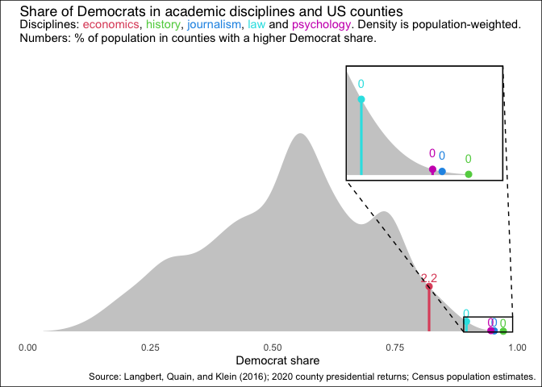
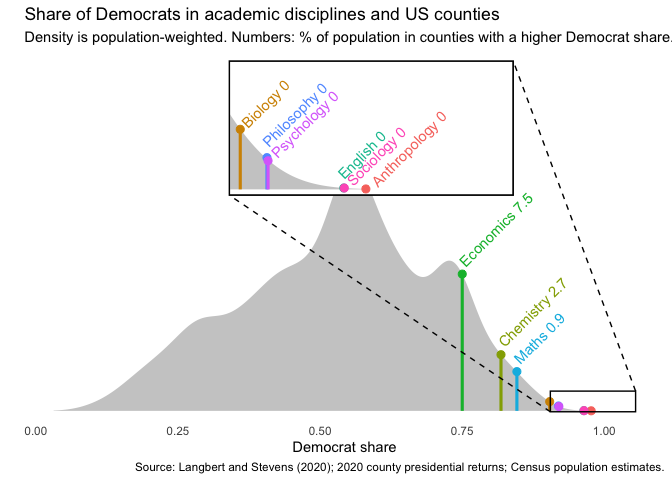

<!-- README.md is generated from README.Rmd. Please edit that file -->

# Academic bias

I sometimes find people claiming there is no political bias in academia,
or that it isn’t a big deal. So I made these graphs to help visualize
the scale of the issue.

The density plot below shows the population-weighted distribution of US
counties by Democratic vote share in 2020. The coloured lines show the
proportion of registered Democrats, out of registered Republicans and
Democrats, in five academic disciplines. I’ve added a zoom inset, in
case you strain your eyes trying to spot the number of Republicans among
history faculty.

<!-- -->

Another set of data comes from Langbert and Stevens (2020):

<!-- -->

To get more disciplines, we can use Langbert (2018), who looks at
professors in liberal arts colleges. I haven’t added the proportion of
the population in more Democratic counties, since it’s essentially zero
for most of this data. But well done to engineering: a full 26% of the
US population lives in counties which are more Democratic than
engineering faculty.

<!-- -->

# FAQ

- How did you make those cool plots?

  After writing the first version of this, I was inspired to create a
  [little R package](https://github.com/hughjonesd/ggmagnify) for making
  insets in ggplot plots. Don’t say the culture war never gave you
  anything!

- Is this satire?

  A little bit, yes. But the data is real.

- This isn’t fair, you’re comparing *registered* Democrats in faculty to
  Democrat *voters* in the US.

  Short answer: dude, suppose I’m out by a factor of ten.

  Long answer: in the 2016 data, we can correct for this by assuming
  that unregistered faculty split their vote equally between Democrat
  and Republican. On this ridiculously generous assumption, our data
  looks like this:

<!-- -->

# Sources

Langbert, M., Quain, A.J. and Klein, D.B., 2016. Faculty voter
registration in economics, history, journalism, law, and psychology.
Econ Journal Watch, 13(3), pp.422-451.

Langbert, M., 2018. Homogenous: The political affiliations of elite
liberal arts college faculty. Academic Questions, 31(2), pp.186-197.

Langbert, M. and Stevens, S., 2020. Partisan registration and
contributions of faculty in flagship colleges. National Association of
Scholars, 17.
